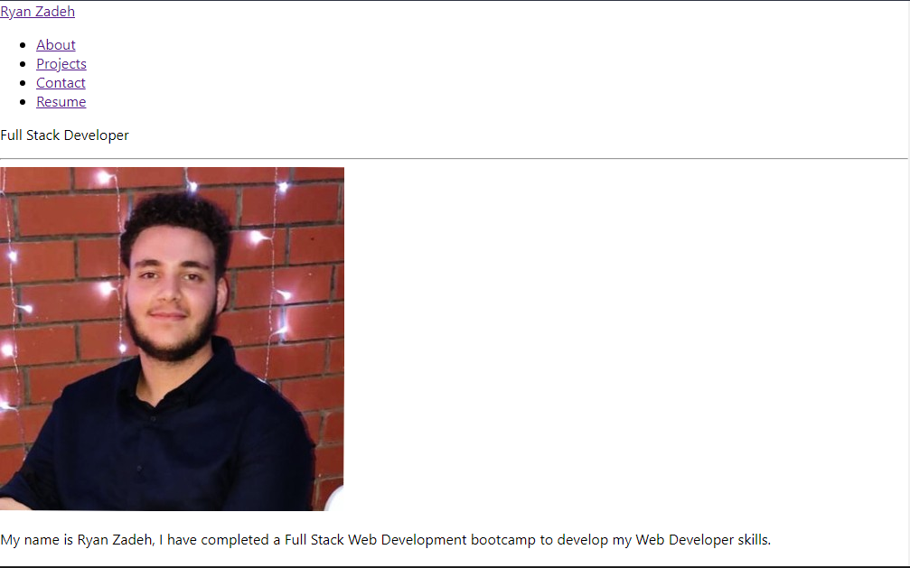

# Ryan's Portfolio

The challenge required students to complete code to create a google book search site that searches books and allows the user to save books on their account.

The app was built using the React front end.

Contents: React

Link: https://ryanzade.github.io/Portfolio/

Please find attached a snippet screenshot of Challenge 21 below:

My GitHub: [RyanZade](https://github.com/RyanZade)
